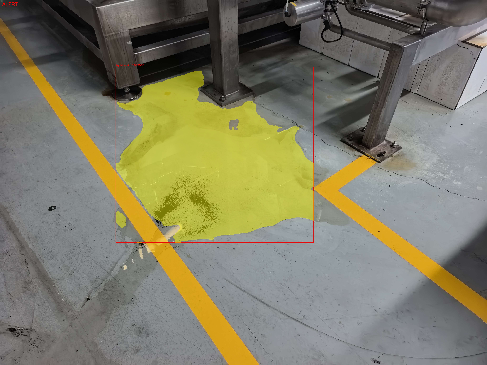

# 漏液检测（leak_detection）

工业场景下的**漏液检测**工程。训练在 Python 侧完成（YOLOv8-Seg），C++ 侧负责 ONNX 部署推理：

```
BGR 图像
  -> Letterbox 前处理（等比缩放 + padding 114）
  -> ONNX Runtime 推理
  -> YOLOv8-Seg 后处理（阈值过滤 / NMS / 掩码生成）
  -> 多帧时序判定
  -> 告警状态
```



> 泵体/法兰接口下方地面的液渍。黄色区域为实例分割掩码，红框为检测框，左上角为告警状态横幅。

## 目录结构

```
leak_detection/
├── CMakeLists.txt          # 构建配置
├── include/
│   └── leak_detector.h     # 对外接口（LeakDetector / LeakItem / LeakConfig / LeakAlertState）
├── src/
│   ├── preprocess.{h,cpp}  # Letterbox 前处理
│   ├── postprocess.{h,cpp} # YOLOv8-Seg 后处理
│   ├── leak_filter.{h,cpp} # 多帧时序判定
│   ├── leak_detector.cpp   # 推理整合（PImpl + ONNX Runtime）
│   └── main.cpp            # 命令行入口
├── tests/
│   ├── test_postprocess.cpp
│   └── test_leak_filter.cpp
├── config/
│   └── leak_rules.json     # 运行参数
├── models/
│   └── leak_yolov8n_seg.onnx
├── docs/
│   ├── result_preview.jpg  # 效果图（随仓库提交）
│   └── test_report.md      # 逐帧测试报告
├── scripts/
│   ├── demo_images.sh      # 批量图片演示 -> docs/demo_grid*.jpg
│   └── demo_video.sh       # 图片序列 -> docs/demo_video.mp4
└── train.py                # 训练脚本（Python 侧，不参与 C++ 构建）
```

## 依赖

| 依赖 | 版本 | 说明 |
|---|---|---|
| CMake | >= 3.20 | |
| C++ 编译器 | C++17 | GCC 11.4 验证通过 |
| OpenCV | 4.x | 组件 core / imgproc / imgcodecs |
| ONNX Runtime | 1.20.1 | C/C++ SDK，**需要自行准备，见下** |

### 准备 ONNX Runtime SDK

`third_party/` 不进版本库，克隆后需自行放置 SDK：

```bash
mkdir -p third_party/onnxruntime
tar xzf onnxruntime-linux-x64-1.20.1.tgz -C third_party/onnxruntime --strip-components=1
```

目录结构应为：

```
third_party/onnxruntime/include/onnxruntime_cxx_api.h
third_party/onnxruntime/lib/libonnxruntime.so
```

CMake 按下述顺序查找，三级降级：

1. 系统安装的 `find_package(ONNXRuntime)`
2. `third_party/onnxruntime/`（用 `find_path` / `find_library` 直接定位）
3. 都找不到则进入 **stub 模式**：仍然编译通过，但 `LoadModel` 返回 `false`、`Infer` 不执行

> 注意：本项目刻意**不使用** ONNX Runtime SDK 自带的 CMake config 文件。官方包里
> `onnxruntimeTargets.cmake` 把库路径写成 `lib64/`、把头文件目录写成 `include/onnxruntime/`，
> 与实际布局（`lib/`、`include/`）不符，会直接导致 CMake 报错。

## 构建

```bash
cmake -S . -B build
cmake --build build -j4
```

## 使用

```bash
./build/leak_detect <model.onnx> <config.json> <image_path> [more_images...]
```

单帧示例：

```bash
./build/leak_detect models/leak_yolov8n_seg.onnx config/leak_rules.json data/images/test/29.jpg
```

输出示例：

```
leak_detector: 配置已加载 input=1280x1280 conf=0.25 iou=0.5 mask=0.5 window=10 min_hits=3
leak_detector: 模型已加载 input=images size=1280x1280 outputs=2
--- frame 0: data/images/test/26.jpg ---
Detected 2 leak(s)
  [0] conf=0.478857 box=[778.525,316.273,1973.12,2605.57] area=836510
  [1] conf=0.393378 box=[1488.87,1028.14,1151.85,1876.86] area=631348
Alert: NO, hits=1, growing=0, down=0
saved output.jpg
```

**输出文件命名**：

| 模式 | 输出 |
|---|---|
| 单图 | `output.jpg` |
| 多图 | `output_0.jpg`、`output_1.jpg`…… |

**多图模式的意义**：多个图片会**按顺序当作连续帧**，共用同一个 `LeakDetector` 实例，
时序状态连续累积。这是验证告警逻辑的唯一方式——**每张图单独起一个进程时，
窗口每次从头开始填，`hits` 永远只能取到 0 或 1**。

```bash
# 9 帧连续序列
./build/leak_detect models/leak_yolov8n_seg.onnx config/leak_rules.json \
  data/images/test/26.jpg data/images/test/27.jpg data/images/test/28.jpg \
  data/images/test/29.jpg data/images/test/30.jpg data/images/test/31.jpg \
  data/images/test/32.jpg data/images/test/33.jpg data/images/test/34.jpg
```

## 配置文件

`config/leak_rules.json`：

```json
{
  "schema_version": 1,
  "model": {
    "input_size": [1280, 1280],
    "num_classes": 1,
    "class_names": ["liquid_stain"],
    "normalize_scale": 0.0039215686
  },
  "postprocess": {
    "candidate_conf": 0.25,
    "iou_threshold": 0.5,
    "mask_threshold": 0.5
  },
  "temporal": {
    "window": 10,
    "min_hits": 3,
    "area_growth_ratio": 1.15,
    "centroid_down_px": 5.0
  }
}
```

| 字段 | 类型 | 默认 | 说明 |
|---|---|---|---|
| `model.input_size` | int[2] | 1280x1280 | 网络输入尺寸。**仅作参考**，`LoadModel` 会以模型实际 shape 覆盖 |
| `postprocess.candidate_conf` | float | 0.25 | 候选框置信度阈值，低于此值丢弃 |
| `postprocess.iou_threshold` | float | 0.5 | NMS 的 IoU 阈值 |
| `postprocess.mask_threshold` | float | 0.5 | 掩码二值化阈值（sigmoid 之后） |
| `temporal.window` | int | 10 | 时序滑动窗口长度（帧） |
| `temporal.min_hits` | int | 3 | 窗口内最少命中帧数 |
| `temporal.area_growth_ratio` | float | 1.15 | 面积增长倍数阈值 |
| `temporal.centroid_down_px` | float | 5.0 | 质心 y 下移像素阈值 |

## 告警逻辑

每帧调用 `LeakFilter::Process`：

1. 累加当前帧所有 `LeakItem` 的掩码面积得 `total_area`，并计算**面积加权质心 y**
2. 三个窗口队列各入队一帧：`area_history_`、`centroid_history_`、`hit_history_`（有检出为 1）
3. 队列超出 `window` 长度时弹出最早一帧
4. **窗口未满（预热期）**：`alert = false`，但 `hit_count` 如实返回当前命中数，
   其余趋势标志为 `false`
5. **窗口已满**：
   - `hits` = 窗口内命中帧数
   - `area_growing` = 末帧面积 > 首帧面积 x `area_growth_ratio`
   - `centroid_down` = 末帧质心 > 首帧质心 + `centroid_down_px`
   - `alert = (hits >= min_hits) && (area_growing || centroid_down)`

> 关键点：**只有命中数是不够的**。即使 `hits` 拉满，若面积不增长且质心不下移，
> 也不告警——避免静止液渍反复误报。

## 测试

```bash
cd build && ctest --output-on-failure
```

当前 2 个用例：

| 用例 | 覆盖内容 |
|---|---|
| `test_postprocess` | 空指针防护、置信度过滤、NMS、letterbox 反变换、掩码裁剪到框内（框外必须全 0） |
| `test_leak_filter` | 滤波器基本可用性 |

详细的逐帧测试报告见 `docs/test_report.md`。

## 演示

两个演示脚本都调用真实的 `build/leak_detect`，所有图片在**同一个进程内按顺序处理**，
因此 `leak_filter` 的滑动窗口会连续累积，即真正走一遍时序判定链路。

### 批量图片演示

```bash
# 默认配置（window=10）-> 预热期，无告警
./scripts/demo_images.sh

# 小窗口配置（window=3）-> 触发告警
CONFIG=/tmp/leak_rules_w3.json ./scripts/demo_images.sh docs/demo_grid_alert.jpg
```

对每张图生成「左原图 / 右检测结果」对比格，再拼成网格。产物：

| 文件 | 配置 | 说明 |
|---|---|---|
| `docs/demo_grid.jpg` | window=10 | 预热期：`hits` 逐帧累加，窗口未满不告警（0/9） |
| `docs/demo_grid_alert.jpg` | window=3 | 告警触发：4/9 格出现 Alert: YES |

> 这两张图各约 1.2 MB，已加入 `.gitignore`，需要本地运行脚本生成。

### 视频演示

```bash
./scripts/demo_video.sh                 # docs/demo_video.mp4，5 fps，每帧停留 1 秒
./scripts/demo_video.sh out.mp4 10 2    # 10 fps，每帧停留 2 秒
```

用 `cv2.VideoWriter` 直接写文件，**不使用 `cv2.imshow`**，不依赖图形界面，
因此可在纯 SSH / 无 `DISPLAY` 的环境下运行。

## 已知限制

1. **`window = 10` 需要至少 10 帧才进入判定**。少于 10 帧时 `alert` 恒为 `false`
   （`hit_count` 仍会正常累加）。
2. **JSON 解析为简易实现**（按键名定位取值），不做完整语法校验，键名重复时只命中第一个。
3. **`LoadModel` 会覆盖 `input_size`**：以模型实际 shape 为准，配置里的值仅作参考。
4. **后处理为单类版本**（`nc = 1`），多类别需要扩展 `PostprocessYoloSeg` 的类别循环。
5. **`third_party/` 不进版本库**，克隆后必须自行准备 ONNX Runtime SDK，否则进入 stub 模式。
6. **浅色液渍存在漏检**。`data/images/test/33.jpg` 与 `34.jpg` 在
   `candidate_conf = 0.25` 下均无检出；阈值降到 `0.15` 仍为 0，只有降到 `0.05`
   时 34.jpg 才勉强出现一个 `conf = 0.053` 的响应。即**不是单纯的阈值问题**，
   而是训练集对这类浅色 / 远景痕迹覆盖不足。
7. **letterbox 假设对称 padding**：`postprocess` 由 `round(orig * ratio) + 2*pad`
   反推网络输入画布尺寸；若改为非对称 padding，需要把输入尺寸显式传入。
